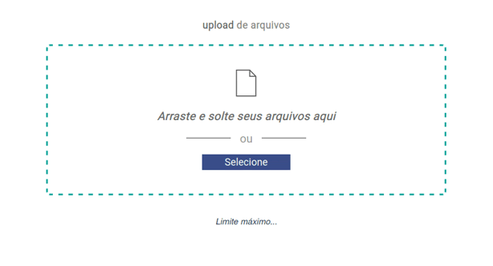

## Um exemplo de upload de arquivos 
*Desenvolvido com Vuejs 2x. (standalone)*





#### Notas

Testado no Firefox e Chrome


#### Abaixo as instruções para execução

```bash


# Inicializando server.js que contem a rota POST /upload

$ cd server/
$ npm install 
$ node server.js 


# Rodando dist.
# (server.js deve ta escutando localmente)

$ npm install serve

# -s flag means serve it in Single-Page Application mode
# which deals with the routing problem below


$ serve -s dist

```

